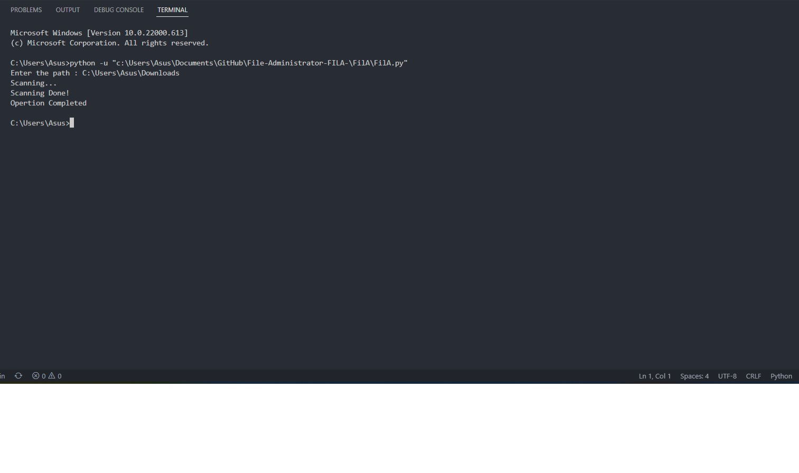

# Aditya Raj

## Table of Contents
* [General Info](#general-information)
* [Technologies Used](#technologies-used)
* [Features](#features)
* [Screenshots](#screenshots)
* [Setup](#setup)
* [Project Status](#project-status)
* [Contact](#contact)

## General Information
A Simple python program that handles Files in provided directory. These files then organized into the respective folders according to their types.

## Technologies Used
- Python

## Features
- Simple UI
- User-friendly 

## Screenshots

## Setup
Extract the given zipped file. You may use Winrar for this. 
Open the extracted folder and run the `FilA.py`file.
Provide the destination that needed to organized.
For sample output of the website, go to img/output folder for screenshots 
of the site.

## Project Status
 _completed_

## Contact
- Project By: **Aditya Raj**.
- <a href="mailto:araj.mishra2000@gmail.com">Email Me</a>